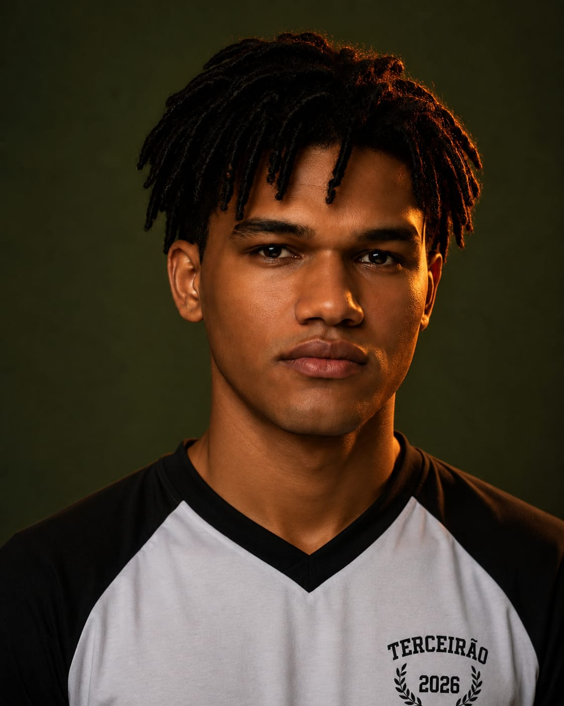

# Persona Principal: Bernardo Silva Cardoso

**Idade:** 17 anos  
**Ocupação:** Estudante  
**Gênero:** Masculino  

### Biografia
Bernardo Silva Cardoso é um estudante do 3º ano do ensino médio, tem como sonho se tornar um jogador profissional de Futmesa. Entretanto, seus pais desejam que ele estude para cursar Engenharia de Software na Universidade Federal do Cariri, caso contrário sua mesada de Robux será cortada. Diante desse difícil dilema, Bernardo busca por aplicativos que organizem sua rotina com facilidade, embora ache apenas aplicativos genéricos de agenda.

### Necessidades
* Dashboard com dados sobre sua evolução.
* Agenda com uso de IA, que organiza automaticamente as matérias nos momentos marcados para estudo.
* Exercícios organizados pela IA, que se encaixem na agenda.

### Objetivos
* Melhorar seu desempenho escolar, visto que o Exame Nacional do Ensino Médio (ENEM) está próximo de ocorrer e seu maior sonho é cursar Engenharia de Software na UFCA.

### Familiaridade com tecnologia
* Tem muita familiaridade com uso de aplicativos para organizar agendas.

### Dificuldades
* Tem dificuldades em organizar uma rotina de estudos e segui-la corretamente de forma que concilie escola, tempo para estudar em casa, tempo livre e prática de esportes.

 
