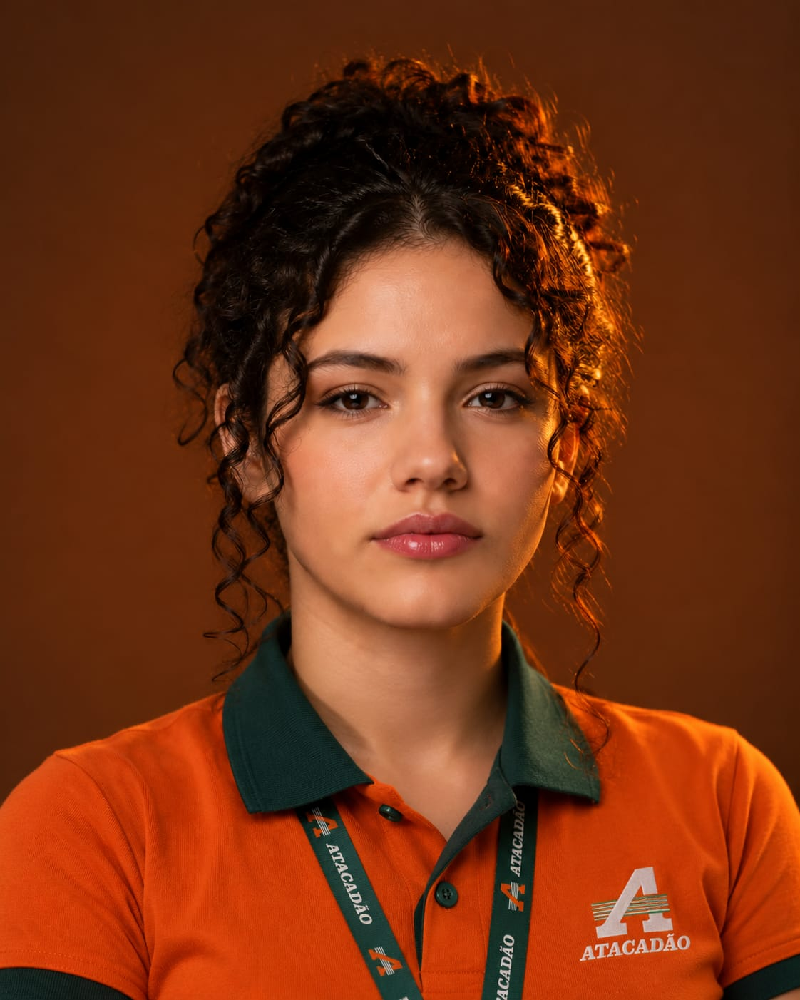

# Persona Secundária: Leonor Lima Barbosa

**Idade:** 23 anos  
**Ocupação:** Gerente de Atacadão  
**Gênero:** Feminino  

### Biografia
Leonor Lima Barbosa é uma mulher de 23 anos, teve adolescência conturbada após o falecimento de sua mãe, o que a forçou a trabalhar ainda no ensino médio pelo programa Jovem Aprendiz. Com o Ensino Médio prejudicado, Leonor abandonou seu sonho de cursar Engenharia de Pesca para focar no seu trabalho no Atacadão. Anos depois, com uma situação financeira mais agradável, Leonor sente-se inspirada em buscar seu sonho, faltando apenas ultrapassar seu último obstáculo: a dificuldade em estudar.

### Necessidades
* Gameficação do aprendizado para incentivar a realização de exercícios e manter-se na rotina.
* Exercícios rápidos que podem ser realizados em pequenas pausas no trabalho.

### Objetivos
* Aprimorar seu desempenho em vestibulares tradicionais para realizar seu sonho de cursar Engenharia de Pesca.

### Familiaridade com tecnologia
* Tem familiaridade com o uso de computador para organizar planilhas e outros programas.

### Dificuldades
* Tem dificuldades em organizar uma rotina de estudos.
* Tem dificuldade em se concentrar na realização de exercícios.

 
